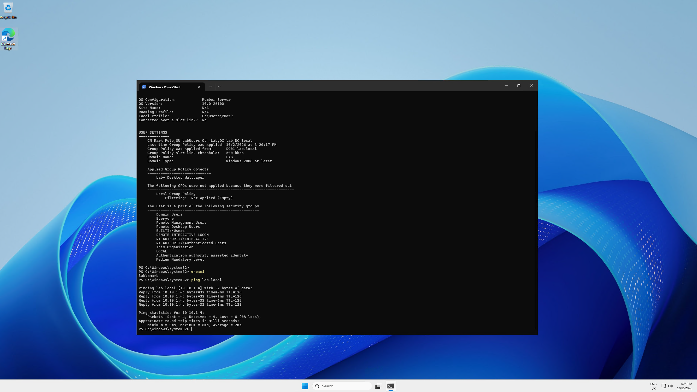

# Active Directory Azure Homelab

Hands-on Active Directory lab built in Microsoft Azure to develop practical skills in Windows Server administration, identity management, Group Policy, and PowerShell automation.

**Context**: Created while working as a Service Desk Analyst to build real infrastructure experience and support a transition into Infrastructure / Cloud roles.

## Lab Overview

| Component              | Details                                      |
|------------------------|----------------------------------------------|
| Platform               | Microsoft Azure                              |
| Domain                 | lab.local                                    |
| Domain Controller      | Windows Server                               |
| Client                 | Domain-joined Windows machine                |
| Networking             | Same VNet and subnet                         |
| DNS                    | Clients point to the Domain Controller       |
| Focus                  | AD DS, Group Policy, PowerShell              |

## What Was Built

- Deployed and configured a Windows Server Domain Controller in Azure
- Created the Active Directory domain `lab.local`
- Configured DNS so clients resolve against the Domain Controller
- Designed Organizational Units and security groups
- Deployed a second virtual machine on the same VNet/subnet and successfully domain-joined it
- Created and linked Group Policy Objects (Desktop Wallpaper and Folder Redirection)
- Verified Group Policy application on the domain-joined client
- Developed PowerShell scripts for Active Directory user creation with validation and error handling

## Key Learning Outcomes

- Active Directory Domain Services installation and configuration
- DNS configuration for domain environments
- Domain join process and client integration
- Group Policy creation, linking, filtering, and troubleshooting
- PowerShell automation using the Active Directory module
- Basic identity and access management concepts

## Architecture Overview

This lab uses a single Azure Virtual Network for simplicity and cost efficiency.

**Azure Resources**
- Resource Group: `rg-adlab-eastus-001`  
- Virtual Network: `vnet-adlab-eastus-001`  
- Subnet: `snet-servers (10.10.1.0/24)`  
- Region: East US  

**Virtual Machines**
| VM Name | Role | Private IP |
|--------|------|------------|
| `vm-adlab-dc-01` | Domain Controller | 10.10.1.4 |
| `vm-adlab-client-01` | Domain-joined Client | DHCP |

## Scripts

| Script | Description |
|--------|-------------|
| [Create_User_V2.ps1](Scripts/Create_User_V2.ps1) | Interactive AD user creation script with input validation and confirmation |
| [New-ADUser-Interactive.ps1](Scripts%20Updated/New-ADUser-Interactive.ps1) | Main interactive AD user creation script with validation, summary, and error handling

## 🖼️ Screenshots

All screenshots are stored in the `/Screenshots` directory:

- [DC Network Configuration](Screenshots/01-dc-network-config.png)  
- [Wallpaper GPO Applied](Screenshots/04-Wallpaper-Gpo-Applied.png)  
- [Folder Redirection GPO](Screenshots/05-gpo-folder-redirection-settings.png)  
- [Folder Redirection Share Setup](Screenshots/06-folder-redirection-share-setup.png)  
- [gpresult Output](Screenshots/07-gpresult-gpos-applied.png)  
- [ADUC Users & Groups](Screenshots/ADUC-Users-Groups-V1Lab.png)  
- [Azure VM Overview](Screenshots/Azure-VM-OverviewV1Lab.png)  
- [Get-ADDomain Output](Screenshots/Get-ADDomain.png)  
- [Windows Server DC](Screenshots/Windows-Server-DC.png)  

#### Active Directory Structure  

#### Wallpaper GPO Applied  

- 
## Documentation

Detailed documentation is available in the `docs/` folder:

- [Network Design](docs/01-network-design.md)
- [DNS Configuration](docs/02-dns.md)
- [Active Directory Setup](docs/03-active-directory.md)
- [OU Design](docs/04-ou-design.md)
- [Troubleshooting](docs/05-troubleshooting.md)

## Next Steps

- Expand PowerShell scripts to support bulk user creation from CSV
- Implement additional Group Policies (mapped drives, security settings)
- Explore hybrid identity with Microsoft Entra Connect
- Introduce Infrastructure as Code using Bicep or Terraform

## Notes

This lab is intentionally kept low-cost. Resources are shut down when not in use. The project is focused on practical learning and portfolio development.
