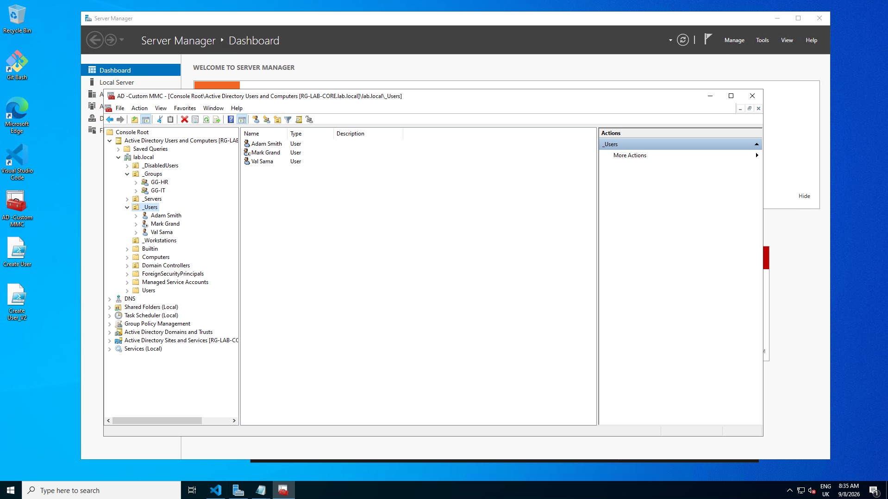

# OU Design

## Structure
lab.local
└── 
_Lab
├── 
LabUsers
├── 
Lab_Security_Groups
└── 
Computers (domain-joined clients)

## Purpose of Each OU

| OU Name               | Purpose                                      |
|-----------------------|-----------------------------------------------|
| _Lab                  | Top-level OU for all lab-related objects      |
| LabUsers              | Stores all user accounts                      |
| Lab_Security_Groups   | Security groups for access control            |
| Computers             | Domain-joined client machines                 |

## Design Notes

- Simple structure for clarity and learning  
- GPOs linked at the _Lab level or specific child OUs  
- Easy to expand with Servers, Admins, or Departments  

## Screenshot

